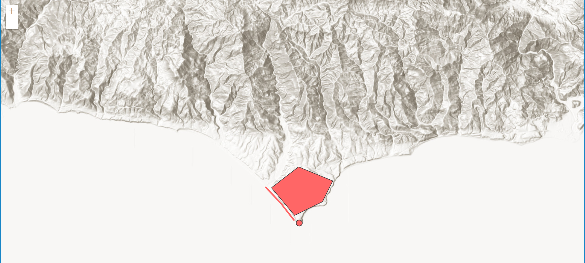
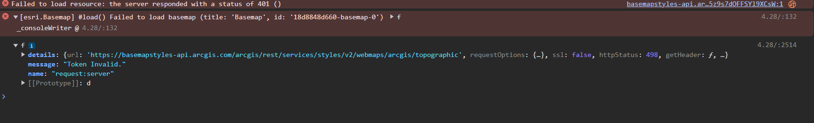
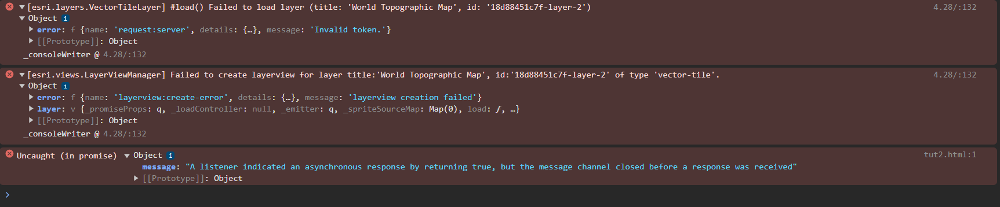

# BUG REPORT
**Bug**: Basemap Load Failure 

 

**Bug Status**: On-hold 

 
**Description**: 
Trying to load the arcgis topographic basemap results in a series of invalid token errors and ultimately a failure to load that basemap style with the generated API key. A few solutions were presented where we could change the value from "arcgis/topographic" to "arcgis-topographic", but the latter fix does not load 100% of the basemap. Just the hillshade is presented. 

 
**Steps to reproduce the bug**: 
Step 1: 
In the line of code that accepts the basemap parameter, enter "arcgis/topographic"  as the value for the "basemap", and then enable an APIkey and you should be able to generate the error in the console 

Step 2: 
In the same line, change the value to "arcgis-topographic",and then enable an APIkey and the same error should persist. 

**Expected Results**: 
Result from Step 1: 
You should be faced with a white background and a control button to zoom in and out of the screen. 
**Result from Step 2**: 
You should be met with a hillshade of the map's center, and the zoom control buttons on the top left of the page. 

**Environment settings**: 

Browser: Google Chrome 

OS: Windows 10 

Working IDE: Visual Studio Code, and GITHUB 

**Scope of the issue**: 
Affects a fairly large percentage of the class.  

 
**Browser Console Errors**: 
Step 1: 

Step2: 

 

 

 

 
